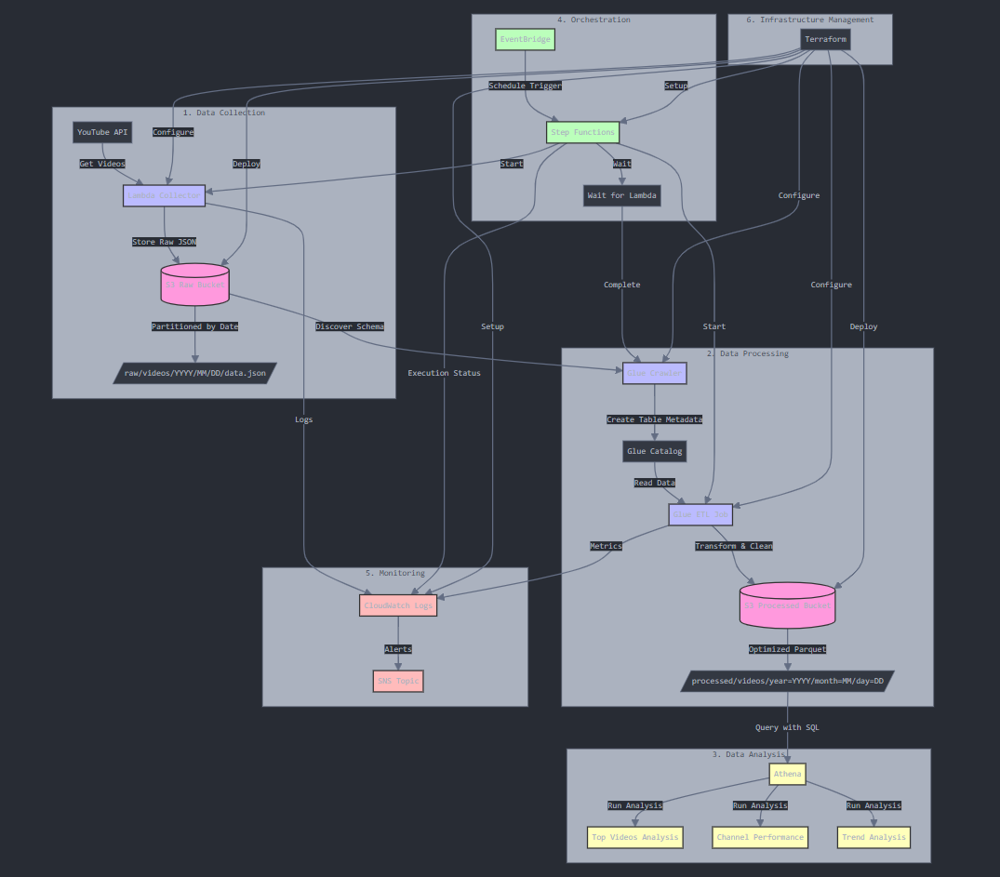

# YouTube Data Pipeline

## Overview

This project is a scalable and serverless data pipeline that collects, processes, and analyzes YouTube trending video data. It leverages AWS services such as Lambda, S3, Glue, Athena, and Step Functions, all orchestrated and provisioned using Terraform.

## Architecture Diagram



## Features

- **Data Collection**: A Lambda function collects trending video data from the YouTube API and stores it in a raw S3 bucket.
- **Data Processing**: AWS Glue jobs transform the raw data and store the processed data in a processed S3 bucket.
- **Data Analysis**: AWS Athena is used to query the processed data for insights.
- **Orchestration**: AWS Step Functions and EventBridge automate the pipeline execution.
- **Infrastructure as Code**: Terraform scripts manage and deploy the entire infrastructure.

## Prerequisites

- AWS Account with necessary permissions
- Terraform installed locally
- AWS CLI configured with your AWS credentials
- YouTube Data API Key

## Setup and Deployment

### 1. Clone the Repository

```bash
git clone https://github.com/yourusername/YouTube_Data_Pipeline.git
cd YouTube_Data_Pipeline
```
### 2. Set Up Environment Variables
Create a .env file or set environment variables for:

* YOUTUBE_API_KEY: Your YouTube Data API key
* AWS_ACCESS_KEY_ID and AWS_SECRET_ACCESS_KEY: Your AWS credentials (if not using AWS CLI profiles)

### 3. Install Terraform Providers

Navigate to the **terraform** directory and initialize Terraform:
```bash
cd terraform
terraform init
```

### 4. Configure Terraform Variables
Create a **terraform.tfvars** file and specify the required variables:
```hcl
project_name = "YouTube_Data_Pipeline"
environment  = "dev"
aws_region   = "us-east-1"
```

### 5. Deploy the Infrastructure
Apply the Terraform scripts to deploy the infrastructure:
```bash
terraform apply
```

### 6. Package Lambda Function
Navigate to the **Lambda function** directory and create a deployment package:
```bash
cd ../src/lambda/youtube_collector
zip -r lambda_function.zip .
```
Upload **lambda_function.zip** to the specified S3 bucket or update the Terraform script to point to the local file.

### 7. Update AWS Glue Scripts
Upload the **transform_data.py** script to the S3 bucket specified in the Terraform script.

## Usage
The data pipeline is scheduled to run every 6 hours as defined in the **EventBridge** rule. You can also trigger the pipeline manually via AWS Step Functions.

## Querying Data with Athena
Use the provided SQL scripts in the **sql** directory to create tables and run analysis queries.
* Create the external table:
```sql
-- Located in create_tables.sql
CREATE EXTERNAL TABLE youtube_videos (
    video_id STRING,
    title STRING,
    views BIGINT,
    likes BIGINT,
    published_date TIMESTAMP
)
PARTITIONED BY (year INT, month INT, day INT)
STORED AS PARQUET
LOCATION 's3://processed-bucket/videos/';
```
* Run analysis queries::
```sql
-- Located in analysis_queries.sql
SELECT 
    title,
    views,
    likes,
    published_date
FROM 
    youtube_videos
WHERE 
    year = 2024
    AND month = 1
ORDER BY 
    views DESC
LIMIT 10;
```

## Cleanup
To destroy all the resources created by **Terraform**:
```bash
terraform destroy
```